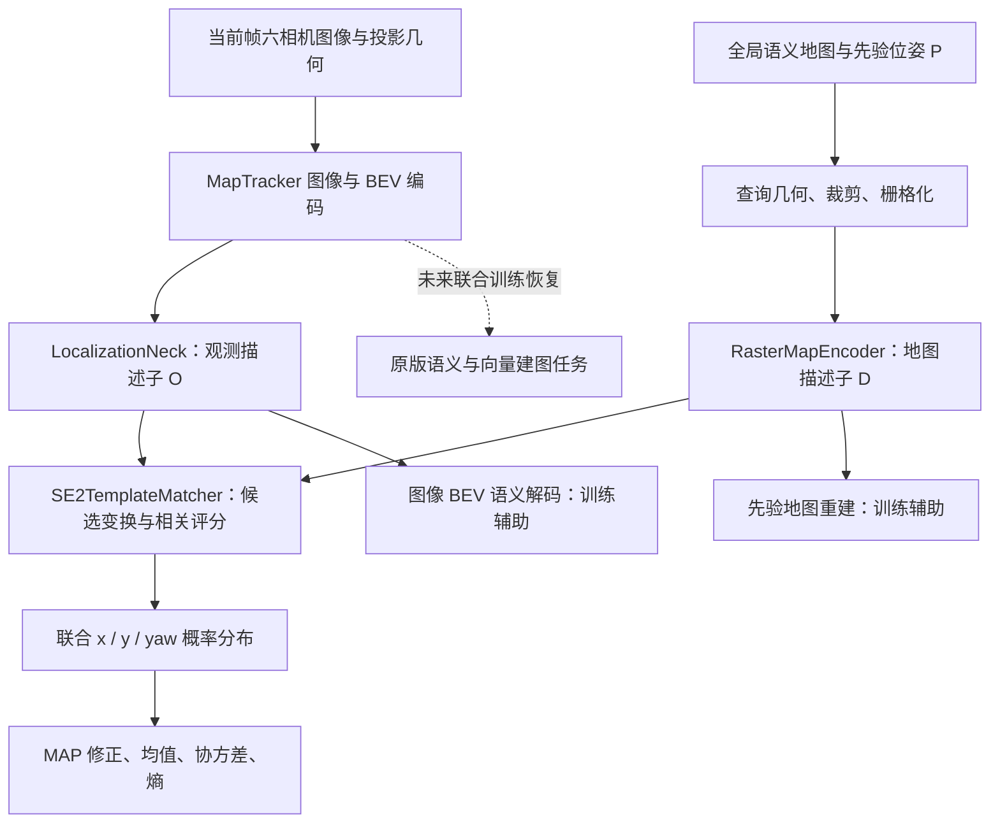

# 基于 MapTracker 的地图定位与联合建图探索

本仓库在 [MapTracker](https://github.com/woodfrog/maptracker) 上增加了图像 BEV 与
先验语义地图之间的局部定位分支。输入当前帧六相机图像、已有地图和带误差的
初始位姿，预测平面位置及航向修正。最终目标是让定位与在线建图共享 BEV
表征并联合训练。

**当前重点是单帧局部 SE(2) 定位。** 已跑通 nuScenes mini 的训练、固定扰动
验证、图像错配对照，以及按带误差位姿重新查询全局地图的裁剪路径。当前定位
配置冻结 BEV 主干、关闭历史与向量头训练；尚未验证在线建图联合训练。

原版论文介绍、作者及使用说明保留在 [README_UPSTREAM.md](README_UPSTREAM.md)。

## 1. 相比原版 MapTracker的改动

| 部分 | 原版 MapTracker | 当前定位分支 |
|---|---|---|
| 主要任务 | 多帧一致性向量 HD 建图 | 增加图像 BEV 与先验地图的局部 x/y/yaw 定位 |
| 观测特征 | 图像主干、BEV 编码、时序记忆 | 复用 BEV 编码，新增 `LocalizationNeck` 输出匹配描述子 |
| 先验地图 | 地图用于建图监督 | 新增 `RasterMapEncoder`，编码三通道语义地图作为定位输入 |
| 位姿估计 | 原建图任务不提供此地图匹配分支 | `SE2TemplateMatcher` 枚举候选，输出 MAP/均值位姿、协方差、熵等 |
| 定位监督 | 无此定位损失 | 软标签候选交叉熵及位姿回归损失 |
| 辅助监督 | 原语义/向量建图头 | 新增描述子地图重建、图像 BEV 语义解码两项辅助任务 |
| 初始验证 | 原版建图评估 | 新增特征级合成扰动 smoke、短训练与固定 mini-val 对照 |
| 地图裁剪 | 按真值位置提取地图监督 | 增加按带误差先验查询全局地图、重新裁剪和栅格化 |
| 数据与工程 | nuScenes/AV2 原版流程 | mini 数据支持、AV2 可选导入、定位专用配置与评估脚本 |

新增定位模块是可选分支，原版建图配置和工具仍保留。当前使用官方 nuScenes
语义地图，尚未接入独立采集会话累计的 LiDAR 地图。

| 主要代码入口 | 用途 |
|---|---|
| [core.py](plugin/models/localization/core.py) | 描述子、SE(2) 匹配、损失、概率解码 |
| [head.py](plugin/models/localization/head.py) | 定位头与两条辅助语义监督 |
| [MapTracker.py](plugin/models/mapers/MapTracker.py) | 接入训练与推理 |
| [nusc_dataset.py](plugin/datasets/nusc_dataset.py) | nuScenes 样本与全局地图查询 |
| [localization_prior.py](plugin/datasets/map_utils/localization_prior.py) | 先验位姿组合及扰动采样 |
| [evaluate_fixed.py](tools/localization/evaluate_fixed.py) | 固定扰动、正确/错配图像、零修正基线评估 |

### 1.1 设计思路：在共享 BEV 上增加地图匹配分支

MapTracker 已经把多相机图像转换为具有空间结构的 BEV 特征，用于预测道路元素。
定位复用这一步：将观测 BEV 和已有地图分别编码到相同维度、相同空间尺度，
搜索哪个平移与旋转能使两者最一致。学习的重点是**跨模态描述子及候选评分**，
候选变换由明确的 SE(2) 几何定义。

定位分支接在 `MapTracker.backbone → MapTracker.neck` 之后。这里新增的
`LocalizationNeck` 属于定位头内部，与原模型的 `neck` 是两个不同模块。
当前分支直接匹配隐空间描述子；两个语义解码器提供辅助监督，不需要先把
图像预测成二值地图再做匹配，也不依赖向量头输出的道路实例。



当前关闭历史帧输入和向量记忆，但仍使用 MapTracker 的 BEV 编码结构；这不等于
从网络内部移除了所有原有历史融合模块。原版 stage-3 权重用于初始化共享网络，
新增的定位描述子和辅助解码器需要通过定位训练学习。

### 1.2 两个编码器如何得到可比较的特征

下表为当前配置的张量尺寸，`B` 表示 batch size，空间维度按高度、宽度排列。
覆盖范围为局部 x 方向 60 m、y 方向 30 m。

| 数据 | 尺寸 | 含义 |
|---|---|---|
| 多相机图像 | `[B, 6, 3, 480, 800]` | 经过尺寸调整和归一化的六相机观测 |
| MapTracker BEV | `[B, 256, 50, 100]` | 原网络产生的观测特征 |
| 先验语义栅格 | `[B, 3, 100, 200]` | 人行横道、分隔线、边界三个二值通道 |
| 观测描述子 `O` | `[B, 32, 25, 50]` | 用于匹配的图像 BEV 描述子 |
| 地图描述子 `D` | `[B, 32, 25, 50]` | 与观测处于同一匹配尺度 |
| 候选 logits / 概率 | `[B, 245]` | 可按 yaw × y × x 看作 `5 × 7 × 7` 概率体 |

`LocalizationNeck` 使用两层 3×3 卷积块，第一层 stride=2，将 256 通道变为
64 通道；再用 1×1 卷积输出 32 维描述子。卷积块采用 GroupNorm 和 SiLU。
输出在每个空间位置沿通道维做 L2 归一化。

`RasterMapEncoder` 使用两次 stride=2 的卷积，再进行特征提取和 1×1 通道投影，
同样输出归一化的 32 维描述子。若尺寸不一致，先双线性调整到观测描述子尺寸。
两个编码器参数不共享：相机 BEV 与语义栅格的输入统计不同，通过共同的匹配损失
学习可以比较的表达。

### 1.3 位姿修正的定义与真实地图裁剪

设 `G` 是观测局部坐标系到全局地图的变换，`P` 是先验裁剪坐标系到全局地图的
变换。定位目标 `C` 把观测坐标转换为先验地图坐标：

$$
C=P^{-1}G, \qquad q_{prior}=Cq_{obs}, \qquad \widehat G=P\widehat C.
$$

因此预测的是**先验坐标系下的局部修正**，不是直接输出全局经纬度。
若目标修正是 `[1.2 m, 0, 0]`，观测原点位于先验原点的局部 x 正方向 1.2 m；
恢复全局位置时，要经过 `P` 的旋转，不能直接对全局 x 加 1.2。

训练与验证拥有真值 `G`，先采样目标修正 `C`，再构造 `P=G C^{-1}`。数据集在
全局矢量地图上查询这个 `P` 对应的窗口，重新裁剪几何、栅格化，最后才编码。
先验窗口可以包含 GT 窗口之外新进入的道路，不能用对 GT 小窗口的平移来替代。
训练每次抽取新扰动；固定评估由 seed 和 sample token 确定目标及错配供体。

实现中 x/y 是局部 BEV 平面的坐标，yaw 为逆时针正方向，内部单位为弧度。
地图提取器沿用原版 LiDAR 中心设置，并额外把 LiDAR 局部几何旋转 −90°；
`localization_prior.py` 因此使用 `lidar_global_yaw + 90°` 定义裁剪输出坐标系，
查询提取器时再转换回去。输入匹配器前翻转栅格的高度轴，使图像向下的行索引
与局部 y 向上的约定一致。这里不改相机外参，完整推导和测试见
[真实裁剪说明](docs/localization_real_crop.md)。

旧特征实验则先在真值位置编码地图，再通过 `C^{-1}` 对描述子做重采样，制造
待匹配特征。它适合验证损失与梯度，但缺少真实裁剪的新进入几何，并可能包含
插值和填充痕迹。两种模式保留为独立配置；真实裁剪模式禁止再次叠加特征扰动。

### 1.4 联合 SE(2) 搜索与相关评分

当前平移候选为 x/y 各 `[-3.6, -2.4, -1.2, 0, 1.2, 2.4, 3.6]` m，yaw 候选为
`[-4, -2, 0, 2, 4]`°，总共 245 个组合。x、y、yaw 共同评分，可以表达不同
方向之间的耦合和多个可能解。搜索范围外的真实误差目前没有单独的“无解”类别。

对于候选 `C_k=(t_x,t_y,theta)`，在观测网格位置 `q=(x,y)` 查询先验地图：

$$
q'=R(\theta)q+t, \qquad \widetilde D_k(q)=\mathrm{bilinear}(D,q').
$$

`grid_sample` 实现这个 output-to-input 采样，采用双线性插值、零填充和
`align_corners=True`。设 `v_k(q)` 表示采样坐标是否在先验地图范围内，则评分为：

$$
s_k=\frac{\sum_q v_k(q)\, O(q)^\top\widetilde D_k(q)}
{\max(1,\sum_q v_k(q))}, \qquad
p_k=\mathrm{softmax}_k(\alpha s_k).
$$

其中 `alpha=clamp(exp(logit_scale), max=100)` 是可学习的分数尺度，初值为 10。
编码器输出已归一化，但插值后的地图向量没有再次归一化，因此实现严格来说是
归一化描述子经插值后的点积评分，而不是每次重算余弦相似度。

有效区域归一化避免把地图外零填充直接当成正常匹配位置；这个 mask 仅表示
几何范围有效，不表示相机可见性，也不是语义前景或遮挡 mask。地图内背景位置
也参与评分，不同候选可能覆盖不同有效区域，因此仍需评估裁剪边界的影响。
候选按 `candidate_chunk_size=32` 分块计算，以控制临时张量大小，不改变候选集合。

### 1.5 输出为什么同时包含 MAP、均值与不确定性

`pose_map` 取最高概率候选，是当前主要定位评估输出。`pose_mean` 的 x/y 是
概率加权均值，yaw 使用圆周均值：

$$
\bar t=\sum_k p_k t_k, \qquad
\bar\theta=\mathrm{atan2}\left(\sum_k p_k\sin\theta_k,
\sum_k p_k\cos\theta_k\right).
$$

均值可以在候选网格之间取值，但多峰或较宽分布的均值可能落在低概率区域；
它不自动等价于可靠的亚网格细化。当前验证中 MAP 明显优于全局概率均值。

输出还包括围绕均值计算的 3×3 候选协方差、熵 `H=-sum(p log p)`、前两名概率比
`peak_ratio`，以及 `confidence=clamp(1-H/log(K), 0, 1)`。协方差中的 yaw 使用
环绕后的弧度差。这些量描述当前候选分布，不是经过外部误差校准的置信区间或
成功概率；当前没有基于 confidence 自动拒绝更新的已验证策略。

定位头返回局部修正，`MapTracker.forward_test` 把它写入每帧结果的 `localization`
字段。`P @ C_pred` 是下游恢复全局位姿的组合方式，目前没有自动把该修正反馈到
MapTracker 历史记忆、地图融合或外部状态估计器。

### 1.6 如何监督定位与描述子

定位损失由软标签交叉熵和概率均值回归组成。对真值修正 `c*`，用候选间隔
`b=(1.2 m, 1.2 m, 2°)` 归一化候选误差，其中 yaw 差做角度环绕：

$$
y_k=\mathrm{softmax}_k\left(-\frac{\|(c_k-c^*)/b\|^2}{2\sigma^2}\right),
\qquad L_{nll}=-\sum_k y_k\log p_k, \qquad \sigma=0.75.
$$

邻近候选也获得部分目标概率，避免把所有相近位姿都当作同样错误。日志中的
`loc_nll` 实际是软标签交叉熵，其理论下界是目标分布熵，不要求训练到零。

`loc_reg` 使用 `pose_mean` 与真值的 Smooth L1；误差按各维搜索最大幅值
`(3.6 m, 3.6 m, 4°)` 归一化，默认权重为 0.25，yaw 同样做环绕。
它与日志中基于 MAP 计算的位姿误差不是同一个量。

为让描述子保留可解释的道路结构，另有两个独立的语义解码器：

| 辅助任务 | 解码输入 | 真实裁剪训练的监督目标 |
|---|---|---|
| 地图重建 | 先验地图描述子 `D` | 带误差位姿下的先验栅格 `localization_map` |
| 图像 BEV 语义 | 观测描述子 `O` | 真值位姿下的栅格 `semantic_mask` |

每个解码器通过卷积及双线性上采样恢复到 `[B,3,100,200]`，逐通道做 sigmoid，
允许语义通道重叠。每项任务使用 sigmoid focal loss（alpha=0.25，gamma=2）与
soft Dice loss，默认两项权重都为 1。地图重建约束地图编码保留输入结构，BEV
语义监督约束图像描述子表达对应道路；它们不能替代正确/错配图像的定位对照。

在当前所有外层权重均为 1 的配置下，总损失为：

$$
L=L_{nll}+0.25L_{reg,raw}
+L_{map,focal}+L_{map,dice}+L_{bev,focal}+L_{bev,dice}.
$$

日志 `loc_reg` 已包含 0.25 权重，汇总时不要重复乘权。
代码支持外部连续 `target_pose`：交叉熵围绕连续真值分配软标签，回归仍监督真实
连续值。但输出搜索网格不变，连续模式下 `loc_exact_acc` 是最近网格分类准确率，
不能解释为连续位姿精确命中。当前标准对照仍使用网格目标。

### 1.7 梯度路径、推理输入与联合建图的关系

真实地图查询、Shapely 裁剪和栅格化在数据准备阶段执行，不对查询位姿求梯度。
描述子编码、候选采样评分、softmax 和均值损失可以反向传播；离散 MAP 的 argmax
仅用于输出和指标，不用它来直接反传。

| 当前配置 | 作用 |
|---|---|
| `freeze_bev=True` | 冻结原 BEV 主干及原分割头参数 |
| `detach_bev=True` | 在定位分支入口切断回到共享 BEV 的梯度 |
| `localization_only=True` | 跳过原分割训练损失 |
| `skip_vector_head=True` | 跳过向量头训练与预测 |
| `use_memory=False`、history steps 为 0 | 不使用跨帧观测或向量记忆输入 |

所以当前更新的是定位观测编码器、地图编码器、分数尺度和两个辅助语义解码器。
“可微定位分支已接入 MapTracker”已实现；“相机到 BEV 主干也由定位损失更新”在
当前 quick/real-crop 配置中尚未开启。

训练需要图像、先验裁剪、真值修正和真值位置语义图。推理定位只需要图像与
投影几何、先验裁剪；GT 修正与 GT 地图不参与匹配。当前实验数据集用真值构造
受控先验，实际应用应由外部初始位姿提供 `P`，再调用地图查询生成输入。
原 `forward_test` 仍执行原分割预测，因此定位专用评估脚本只运行所需的 BEV
和定位模块，以避免不必要的建图输出。

后续联合训练需要同时解除 `freeze_bev` 与 `detach_bev`，恢复原分割/向量建图
任务，使共享 BEV 接受定位损失与建图损失。还需设计两类损失的权重和训练节奏，
同时评估定位与建图，确认一种任务没有损害另一种。预测位姿参与历史对齐或地图
更新是更进一步的闭环设计，目前没有实现，也不能由“共享 BEV”自动推导出来。

## 2. 已验证内容与当前边界

截至 2026-09-16：

- mini-train：323 帧、8 个场景；mini-val：81 帧、2 个场景。
- 特征级扰动配置完成 500 次训练，batch size 4，无 NaN/Inf 或 OOM。
- 100/300/500 次 checkpoint 均完成 mini-val 固定扰动对照。
- 真实裁剪路径完成全量 mini-val 初始评估；batch size 1 和 4 均完成 5 步训练、反传及保存。
- 实际地图零扰动裁剪与原 GT 栅格一致，SE(2) 方向经过几何测试。
- 完整推理删除 GT 地图和位姿标签后，仍能由图像与先验地图输出相同定位结果。
- 12 项定位评估/几何/监督测试通过。

同一个旧 `iter_500.pth`，81 帧 × 5 个固定扰动的初始对照如下。
平移为平均 L2 误差，yaw 为平均绝对误差，使用 MAP 候选输出：

| 验证条件 | 精确候选命中率 | 平移误差 | yaw 误差 |
|---|---:|---:|---:|
| 不修正初始位姿 | 0.25% | 3.187 m | 2.331° |
| 特征级扰动，正确图像 | 73.83% | 0.201 m | 0.321° |
| 特征级扰动，跨场景错配图像 | 1.73% | 4.379 m | 3.091° |
| 真实地图裁剪，正确图像 | 67.41% | 0.275 m | 0.425° |
| 真实地图裁剪，跨场景错配图像 | 0.25% | 4.615 m | 3.032° |

真实裁剪这组结果使用的是旧特征任务权重，**不是完成真实裁剪长期微调后的成绩**。
新裁剪输入仍然有效，但需要针对新协议训练。

这些成绩只覆盖局部、离散候选任务。候选间隔为 1.2 m / 2°，目标也从网格抽取，
所以 0.201 m 的平均误差不能解释为连续定位已达到 20 cm 精度。初始位姿误差仍
由实验合成；“真实裁剪”指在全局地图上重新查询几何，而非变换 GT 地图特征。
当前 mini-train/mini-val 场景互不重叠，但未核验上游预训练权重是否见过相同场景。
405 组包含重复帧及相关场景，不是 405 个独立场景。

## 3. 环境

本机已验证环境是 Windows + WSL2 Ubuntu 22.04，RTX 4060 Laptop 8 GB。
以下命令均在 **WSL Ubuntu 终端**执行，使用独立的 `maptracker` conda 环境，
不要与 CALIB 环境混用。

| 依赖 | 本机验证版本 |
|---|---|
| Python | 3.8 |
| PyTorch | 1.13.1+cu117 |
| PyTorch CUDA runtime | 11.7 |
| MMCV-full | 1.7.0 |
| MMDetection | 2.28.2 |
| MMSegmentation | 0.30.0 |
| MMDetection3D | 1.0.0rc6 |

已有环境的启动与检查：

```bash
conda activate maptracker
cd /mnt/e/source_code/maptracker
export LD_LIBRARY_PATH="/usr/lib/wsl/lib:$CONDA_PREFIX/lib:${LD_LIBRARY_PATH:-}"

python -c "import torch; print(torch.__version__, torch.version.cuda, torch.cuda.is_available())"
python tools/localization/smoke_test.py --device cuda
python -m unittest discover -s tools/localization -p 'test_*.py' -v
```

`/usr/lib/wsl/lib` 用于让 cuDNN 找到 WSL 提供的 `libcuda.so`。驱动支持的 CUDA
版本与 PyTorch 自带 runtime 版本不是同一概念，不要求版本号相同。
AV2 在 Python 3.8 上不可用的可选导入提示不影响当前 nuScenes 实验。

从空环境安装时可参考 [原版安装说明](docs/installation.md)，但其中 PyTorch
1.9/MMCV 1.6 是原版组合，与上表本机已验证组合不同；不要直接覆盖已跑通的环境。
原 `requirements.txt` 包括 AV2 等上游依赖，并不是当前 WSL 环境的完整锁定文件。

## 4. 数据和权重

本机数据位于 Windows `D:\nuscenes\mini`，WSL 路径为 `/mnt/d/nuscenes/mini`。
项目中 `datasets/nuscenes` 已链接到该目录。换机器时需建立自己的数据路径。

```text
datasets/nuscenes/
├── samples/
├── sweeps/
├── v1.0-mini/
├── maps/
│   └── expansion/                 # 官方地图拓展 1.3 的四个 JSON
├── nuscenes_map_infos_train.pkl
└── nuscenes_map_infos_val.pkl
```

上述 PKL 已存在时不必重建。新数据目录可执行：

```bash
python tools/data_converter/nuscenes_converter.py \
  --data-root ./datasets/nuscenes --version v1.0-mini
```

定位 quick/real-crop 配置使用 `multi_frame=False, matching=False`，无需生成
`*_gt_tracks.pkl`；原版时序建图训练仍按 [数据准备说明](docs/data_preparation.md) 操作。

第一次训练定位分支所需的原版 stage-3 权重：

```text
work_dirs/pretrained_ckpts/
└── maptracker_nusc_oldsplit_5frame_span10_stage3_joint_finetune/
    └── latest.pth
```

下载入口见 [数据与权重说明](docs/data_preparation.md#checkpoints)。这个预训练
`latest.pth` 应是实际 checkpoint 文件；不要使用以前在 NTFS 上生成失败的空链接。

本机已完成的定位权重位于 `work_dirs/localization_mini_500iter/iter_500.pth`。
新的真实裁剪配置默认从它初始化；`work_dirs` 中的数据和权重不由源码提供，
新机器必须复制该权重，或先完成下面的阶段 A。

## 5. 训练

### 阶段 A：特征级扰动基线

用于复现已经完成的基线。现有本机权重可直接进入阶段 B。

```bash
python tools/train.py \
  plugin/configs/bev_localization/nuscenes_raster_localization_quick.py \
  --work-dir work_dirs/localization_feature_500iter_run2 \
  --no-validate --seed 0 \
  --cfg-options \
  data.samples_per_gpu=4 data.workers_per_gpu=2 \
  runner.max_iters=500 lr_config.warmup_iters=50 \
  log_config.interval=10 \
  checkpoint_config.interval=100 checkpoint_config.create_symlink=False
```

### 阶段 B：带误差位姿下的真实地图裁剪

这是当前建议推进的训练入口。默认冻结 BEV，batch size 4、500 次迭代，
学习率从新计划开始，每 100 次保存权重。

```bash
python tools/train.py \
  plugin/configs/bev_localization/nuscenes_raster_localization_real_crop.py \
  --work-dir work_dirs/localization_mini_real_crop_500iter \
  --no-validate --seed 0 \
  --cfg-options log_config.interval=10
```

若阶段 A 的权重位于其他目录，再加
`load_from=work_dirs/localization_feature_500iter_run2/iter_500.pth`。
`load_from` 用于初始化权重；只有中断后继续**同一实验**时，才用
`--resume-from 路径/iter_XXX.pth` 恢复优化器与迭代状态。

只检查 pipeline 时，将阶段 B 命令的 `--work-dir` 换为新目录，并覆盖
`runner.max_iters=20 lr_config.warmup_iters=5 checkpoint_config.interval=20`。

游戏等程序会占用同一张显卡，应在 GPU 空闲时比较吞吐和显存。共享 GPU 时可
覆盖 `data.samples_per_gpu=1 data.workers_per_gpu=0`。batch 1 的 500 次约遍历
mini-train 1.55 遍；batch 4 的 500 次约 6.2 遍，二者不是相同训练样本预算。
GPU 空闲时，本机 batch 4 真实裁剪短训练的常规迭代约 0.9 秒，日志显存约 2.3 GB；
这不是整卡总占用，也不是不同设备上的性能保证。

日志位于输出目录的 `*.log`、`*.log.json`，关键指标包括：

- `loc_nll`、`loc_reg`：定位损失；NLL 使用软标签，不以降到零为目标。
- `loc_exact_acc`：网格目标下的精确命中率，245 候选的均匀随机水平约 0.41%。
- `loc_err_x_m`、`loc_err_y_m`、`loc_err_yaw_deg`：训练 MAP 候选误差。
- `loc_map_recon_miou`、`loc_bev_sem_miou`：地图重建及图像 BEV 语义指标。
- `grad_norm`：梯度范数，检查是否有 NaN/Inf。

新裁剪训练中，地图重建使用带误差的先验地图作目标；图像 BEV 语义仍使用
真值位置地图作目标，两者不能混用。更详细的坐标定义见
[真实地图裁剪说明](docs/localization_real_crop.md)。

## 6. mini-val 验证与对照

定位训练暂用 `--no-validate`，因为原版默认评估器汇总的是地图指标，不能替代
定位评估。下面脚本不更新权重，使用全部 mini-val，并保存固定扰动清单。

复现旧特征级扰动对照：

```bash
python tools/localization/evaluate_fixed.py \
  plugin/configs/bev_localization/nuscenes_raster_localization_quick.py \
  work_dirs/localization_mini_500iter/iter_100.pth \
  work_dirs/localization_mini_500iter/iter_300.pth \
  work_dirs/localization_mini_500iter/iter_500.pth \
  --out-dir work_dirs/localization_mini_val_feature_run2 \
  --map-source feature --repeats 5 --seed 20260916
```

真实裁剪训练完成后，在相同裁剪上比较旧权重与新权重：

```bash
python tools/localization/evaluate_fixed.py \
  plugin/configs/bev_localization/nuscenes_raster_localization_real_crop.py \
  work_dirs/localization_mini_500iter/iter_500.pth \
  work_dirs/localization_mini_real_crop_500iter/iter_500.pth \
  --out-dir work_dirs/localization_mini_val_real_crop_compare \
  --map-source real --repeats 5 --seed 20260916
```

新权重尚不存在时，删除第二个 checkpoint 参数即可评估旧权重的初始性能。
每次使用新的空输出目录，以免覆盖已有实验。

三种条件共用目标帧、地图与扰动：`correct` 使用正确图像，`mismatched` 使用
另一验证场景的整组六相机观测，`identity` 预测零修正。错配图像先使用供体自身
相机几何编码，再替换观测描述子，不混用两帧的相机外参。

| 输出 | 内容 |
|---|---|
| `manifest.json` | sample token、固定目标、错配供体；真实裁剪还记录全局位姿 |
| `prior_rasters.npz` | 真实裁剪模式生成的实际先验地图 |
| `*_records.json` | 每组 MAP/均值预测、目标、熵及置信度 |
| `*_summary.json`、`summary.json` | 全局与分场景误差、命中率、成功率、语义诊断 |

默认成功阈值为平移 ≤1 m 且 yaw ≤1°。在当前 1.2 m / 2° 网格目标上，
MAP 成功率与精确命中率相同。概率均值输出也单独统计，避免只看最高分候选。
confidence 目前由熵计算，尚不是校准后的成功概率。

## 7. 下一步工作

1. 完成真实裁剪协议下的 mini-train 微调，并与旧权重在相同固定 mini-val 对比。
2. 可视化 `scene-0916` 的失败帧，增加同场景不同位置的困难错配及边界影响对照。
3. 验证非网格连续扰动、局部位姿细化和可信的拒绝更新机制。
4. 定位验证稳定后，再解冻共享 BEV、恢复建图损失，验证联合训练。

现有接口允许定位与建图使用同一 BEV，但仅修改 `freeze_bev` / `detach_bev`
并不等于完成联合训练；还需要恢复建图分支、配置损失并进行双任务评估。

## 8. 文档与原版功能

- [定位 quickstart 与固定评估协议](docs/localization_quickstart.md)
- [特征级扰动实验记录](docs/localization_mini_val_20260916.md)
- [真实地图裁剪、坐标约定与训练命令](docs/localization_real_crop.md)
- [原版训练、推理、评估与可视化](docs/getting_started.md)
- [原版环境安装](docs/installation.md) · [原版数据准备](docs/data_preparation.md)

## 9. 来源、引用与许可

本项目基于 MapTracker（ECCV 2024 Oral）及其所使用的 BEVFormer、StreamMapNet、
MapTR 等开源工作扩展。本分支的定位实验结果不代表原版 MapTracker 的论文结果。
上游作者信息、项目链接与致谢保留在 [原 README](README_UPSTREAM.md)。

```bibtex
@inproceedings{chen2024maptrakcer,
  author = {Chen, Jiacheng and Wu, Yuefan and Tan, Jiaqi and Ma, Hang and Furukawa, Yasutaka},
  title = {MapTracker: Tracking with Strided Memory Fusion for Consistent Vector HD Mapping},
  journal = {arXiv preprint arXiv:2403.15951},
  year = {2024}
}
```

保留原仓库 [LICENSE](LICENSE) 与 [LICENSE_GPL](LICENSE_GPL)：原声明限制商业使用，
研究用途遵循其中列出的 GPLv3 条款。本分支没有变更该许可声明。
